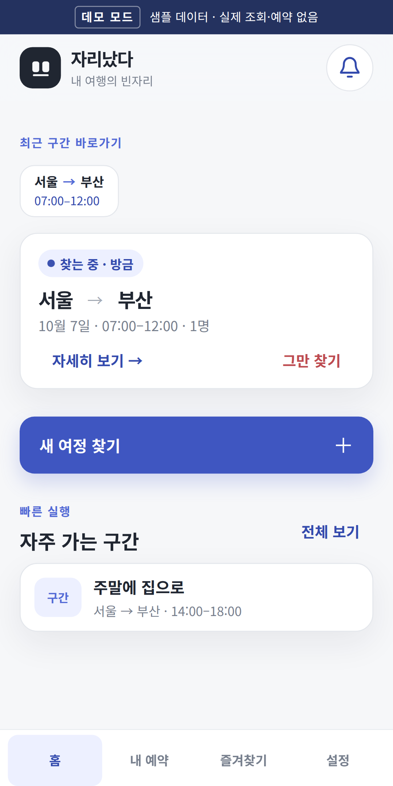
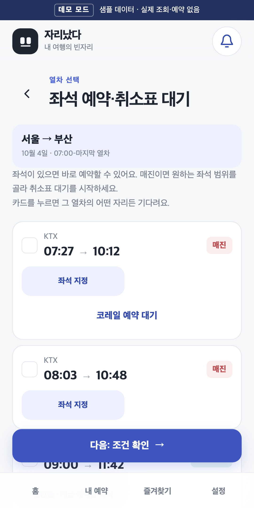
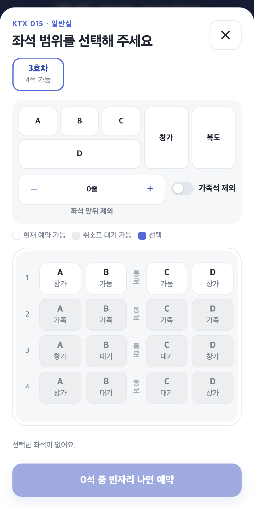
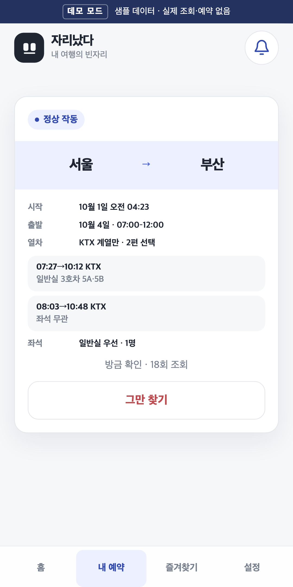
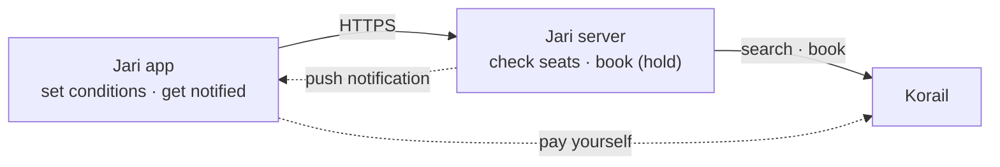

<div align="center">


# 자리났다 (Jari)

**An Android app that watches sold-out Korail trains for you<br>and books a seat (held for payment) the moment one opens up**

[한국어](README.md) · **English**

[](https://github.com/thsvkd/jari-android/releases/latest)
[](https://github.com/thsvkd/jari-android/actions/workflows/verify.yml)
[](LICENSE)

</div>

<p align="center">
  
  
  
  
</p>

> The app and the detailed docs are in Korean. This page is an English overview and quick start.

## What is 자리났다?

*자리났다* means "a seat opened up." Even when KTX trains are sold out on holidays and weekends, cancelled tickets keep coming back. Jari watches for them so you don't have to.

- **Set it and forget it.** Pick the date, time window, trains and seat conditions; the server keeps checking even after you close the app.
- **Only the seats you want.** Choose trains, standard or first class, cars, window or aisle, and rows to skip. Seats that don't match are never taken.
- **Notified the moment it's yours.** When a seat opens, the server books it (held, not yet paid) and sends a phone notification. You pay in the Korail app yourself.



**Flow**: New journey → pick trains and seats → review conditions → start searching → get notified → pay in Korail

## Quick start

Follow the one path that matches what you want to do.

| I want to… | You need | Result |
|---|---|---|
| [1. Use it on my phone](#1-use-it-on-my-phone) | An Android 7.0+ phone and an invite code (or try the sample mode) | Seat searches on your phone |
| [2. See the demo in a browser](#2-see-the-demo-in-a-browser) | Node.js 22.12+ | Every screen with sample data |
| [3. Run my own server](#3-run-my-own-server) | Docker and an HTTPS address | Your own server to share with friends |

### 1. Use it on my phone

1. Download `jari-<version>-debug.apk` from the [latest release](https://github.com/thsvkd/jari-android/releases/latest) and install it. You may need to allow installing apps from unknown sources. If you are registered as a Google Play internal tester, install it from the Play Store instead.
2. Open the app and sign up under **초대 회원 → 처음 가입** (Invited member → First sign-up) with the invite code you got from the operator.
   No invite code? Tap **체험하기** (Try it) to browse every screen with sample data. Nothing is actually booked.
3. Link your Korail account in **설정 → 코레일 계정** (Settings → Korail account), then set up a search with **새 여정 찾기** (New journey) on the home screen.

> [!NOTE]
> Release APKs connect to the operator's server. To use your own server, follow [path 3](#3-run-my-own-server).
> The Play Store app and the release APK are signed differently and cannot update each other; use only one of them on a phone.

### 2. See the demo in a browser

No server and no Korail account needed. It runs the real screens on sample data.

```bash
git clone https://github.com/thsvkd/jari-android.git
cd jari-android
npm ci
npm run dev -- --mode demo
```

Open <http://127.0.0.1:4173>. If you see the "데모 모드" (demo mode) banner at the top, it works. Your browser's device mode (phone screen size) gives the closest look to the real app.

### 3. Run my own server

Run the API server and Redis with Docker Compose, then build an app that connects to that server.

**① Prepare the server key** — creates the encryption key and a placeholder for the notification credentials.

- Windows (PowerShell): `.\scripts\init-backend.ps1`
- macOS and Linux: there is no setup script yet. See [Prepare the server key](docs/self-hosting.md#1-서버-키-준비) (Korean) for the key file requirements and for running without Docker.

**② Start the server and create your admin account**

```bash
docker compose up --build -d                     # API (127.0.0.1:8081) and Redis
curl http://127.0.0.1:8081/api/mobile/health     # {"ok":true,...} means it's up

# Your admin account: run it, then type the password (12+ characters) on one line and press Enter
docker compose exec -T api python -m korail_bot.mobile admin --username <your-id>
```

The password is visible while you type. A hidden-input variant is in [Admin account and invite codes](docs/self-hosting.md#3-관리자-계정과-초대-코드) (Korean).

**③ Connect your phone and invite friends**

- Phones connect to the server over HTTPS only. Put a reverse proxy in front of the server and build the app with that address: [Publish over HTTPS](docs/self-hosting.md#4-https로-공개하기) → [Connect the app to your server](docs/self-hosting.md#5-앱을-내-서버에-연결하기) (Korean)
- In that app, log in as **관리자** (Admin) and create invite codes for friends under **설정 → 회원 관리** (Settings → Members). To create one on the server instead: `docker compose exec api python -m korail_bot.mobile invite --ttl-hours 24`.

## Documentation

The detailed docs are written in Korean.

| Document | For | Contents |
|---|---|---|
| [Self-hosting guide](docs/self-hosting.md) | Server operators | Server key, Docker, admin and invites, HTTPS, an app for your server, remote deploy, backups |
| [Server configuration reference](backend/README.md) | Changing server settings | Environment variables, CLI commands, API scope, security, background jobs and notifications |
| [Android build and release](docs/android.md) | Building or releasing the app | Prerequisites, APK and AAB builds, signing keys, push notifications (Firebase), package name history |
| [Development guide](docs/development.md) | Changing the code | Local setup, tests and CI, layout rules, branch and commit rules |
| [Product requirements (PRD)](docs/PRD.md) | Product intent | What it is, who it's for, and why |
| [Technical spec (SPEC)](docs/SPEC.md) | Internals | Architecture, API contract, status rules, restart recovery, account deletion |
| [AGENTS.md](AGENTS.md) | AI coding agents | Rules for working in this repository |

## Repository layout

```text
src/        App screens (TypeScript + Vite, running in a Capacitor WebView)
android/    Android project (Capacitor 7)
backend/    API server (Python 3.13, Flask), a standalone package
e2e/        Playwright end-to-end and layout checks
monitor/    Cloudflare Worker for external uptime monitoring
scripts/    Build, release, deploy and verification scripts
store/      Play Store icon, graphics and screenshots
docs/       Product, spec and guide documents
```

## Scope and limitations

- **Korail trains only.** SRT accounts are not used; high-speed trains from Suseo are searched with your Korail account too.
- **No payment.** Once a seat is held, you pay in the Korail app before the payment deadline.
- **Invite only.** Sign-up requires an invite code issued by the operator.
- Korail's official waitlist is requested for standard class only, without choosing seat positions.
- Installs on Android 7.0 (API 24) or later.
- Automated tests never reach the real Korail. They use a fake Korail built from the real library classes ([development guide](docs/development.md#테스트와-검증)).

## Origin and license

This repository splits the Android app and its dedicated API server out of a fork of GeunSam2 (Gray)'s Telegram bot, `korail_KTX_macro_telegrambot`. It does not run the Telegram bot; the server package keeps the name `korail_bot` for compatibility. The MIT copyright of the original author and of the fork is kept in [LICENSE](LICENSE).
