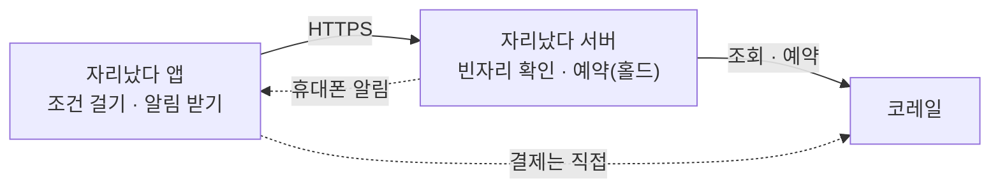

<div align="center">


# 자리났다

**매진된 코레일 열차의 빈자리를 대신 지켜보다가,<br>자리가 나면 결제 전 예약까지 잡아 주는 Android 앱**

**한국어** · [English](README.en.md)

[](https://github.com/thsvkd/jari-android/releases/latest)
[](https://github.com/thsvkd/jari-android/actions/workflows/verify.yml)
[](LICENSE)

</div>

<p align="center">
  
  
  
  
</p>

## 자리났다는 무엇인가요?

명절·주말 KTX가 매진이어도 취소표는 수시로 나옵니다. 자리났다는 그 빈자리를 사람 대신 지켜봅니다.

- **걸어 두고 잊으세요.** 날짜·시간대·열차·좌석 조건을 정하면 서버가 앱을 닫아도 계속 빈자리를 확인합니다.
- **원하는 자리만 잡습니다.** 열차, 일반실·특실, 호차, 창가·복도, 앞뒤 줄 제외까지 고를 수 있고 조건에 맞지 않는 자리는 잡지 않습니다.
- **잡으면 바로 알려 줍니다.** 자리가 나면 결제 전 예약(홀드)까지 잡고 휴대폰 알림을 보냅니다. 결제는 코레일 앱에서 직접 합니다.



**쓰는 순서**: 새 여정 찾기 → 열차·좌석 고르기 → 조건 확인 → 빈자리 찾기 시작 → 알림 받기 → 코레일에서 결제

## 빠른 시작

하려는 일에 맞는 길 하나만 따라가면 됩니다.

| 하려는 일 | 필요한 것 | 결과 |
|---|---|---|
| [1. 휴대폰에서 바로 쓰기](#1-휴대폰에서-바로-쓰기) | Android 7.0 이상 휴대폰, 초대 코드(없으면 체험하기) | 내 폰에서 빈자리 찾기 |
| [2. 브라우저에서 데모 보기](#2-브라우저에서-데모-보기) | Node.js 22.12 이상 | 샘플 데이터로 모든 화면 둘러보기 |
| [3. 내 서버 직접 운영하기](#3-내-서버-직접-운영하기) | Docker, HTTPS로 공개할 주소 | 지인과 함께 쓰는 나만의 서버 |

### 1. 휴대폰에서 바로 쓰기

1. [최신 릴리스](https://github.com/thsvkd/jari-android/releases/latest)에서 `jari-<버전>-debug.apk`를 받아 설치합니다. 설치할 때 ‘출처를 알 수 없는 앱 설치’를 허용해야 할 수 있습니다. Google Play 내부 테스터로 등록된 분은 Play 스토어에서 받습니다.
2. 앱을 열고 **초대 회원 → 처음 가입**에서 운영자에게 받은 초대 코드로 가입합니다.
   초대 코드가 없다면 **체험하기**를 누르세요. 샘플 데이터로 모든 화면을 둘러볼 수 있고 실제 예약은 되지 않습니다.
3. **설정 → 코레일 계정**에서 코레일 계정을 연결하고, 홈의 **새 여정 찾기**로 조건을 겁니다.

> [!NOTE]
> 릴리스 APK는 운영자 서버에 연결됩니다. 직접 운영하는 서버에 붙이려면 [3번](#3-내-서버-직접-운영하기)을 따르세요.
> Play에서 받은 앱과 릴리스 APK는 서명이 달라 서로 업데이트되지 않으니, 한 휴대폰에서는 한쪽만 씁니다.

### 2. 브라우저에서 데모 보기

서버도 코레일 계정도 필요 없습니다. 샘플 데이터로 실제와 같은 화면을 띄웁니다.

```bash
git clone https://github.com/thsvkd/jari-android.git
cd jari-android
npm ci
npm run dev -- --mode demo
```

브라우저에서 <http://127.0.0.1:4173>을 엽니다. 화면 맨 위에 ‘데모 모드’ 띠가 보이면 성공입니다. 개발자 도구의 기기 모드(휴대폰 화면 크기)로 보면 실제 앱과 비슷하게 보입니다.

### 3. 내 서버 직접 운영하기

API 서버와 Redis를 Docker Compose로 띄우고, 그 서버에 연결되는 앱을 직접 빌드합니다.

**① 서버 키 준비** — 서버 암호화 키와 알림 설정 자리를 만듭니다.

- Windows(PowerShell): `.\scripts\init-backend.ps1`
- macOS·Linux: 아직 준비 스크립트가 없습니다. [서버 키 준비](docs/self-hosting.md#1-서버-키-준비)에서 키 파일 요건과 Docker 없이 바로 띄우는 방법을 확인하세요.

**② 서버 실행과 관리자 계정**

```bash
docker compose up --build -d                     # API(127.0.0.1:8081)와 Redis
curl http://127.0.0.1:8081/api/mobile/health     # {"ok":true,...} 이면 정상

# 내 관리자 계정: 실행한 뒤 비밀번호(12자 이상)를 한 줄 입력하고 Enter
docker compose exec -T api python -m korail_bot.mobile admin --username <아이디>
```

입력한 비밀번호가 화면에 보입니다. 숨겨서 입력하는 방법은 [관리자 계정과 초대 코드](docs/self-hosting.md#3-관리자-계정과-초대-코드)에 있습니다.

**③ 휴대폰 연결과 지인 초대**

- 휴대폰은 HTTPS 주소로만 서버에 연결합니다. 리버스 프록시로 서버를 공개하고 그 주소로 앱을 빌드합니다: [HTTPS로 공개하기](docs/self-hosting.md#4-https로-공개하기) → [앱을 내 서버에 연결하기](docs/self-hosting.md#5-앱을-내-서버에-연결하기)
- 그 앱의 로그인 화면에서 **관리자**로 로그인하고 **설정 → 회원 관리**에서 지인에게 줄 초대 코드를 만듭니다. 서버에서 바로 만들려면 `docker compose exec api python -m korail_bot.mobile invite --ttl-hours 24`입니다.

## 문서 안내

| 문서 | 이런 분께 | 내용 |
|---|---|---|
| [서버 운영 가이드](docs/self-hosting.md) | 서버를 직접 운영하는 분 | 서버 키, Docker 실행, 관리자·초대, HTTPS 공개, 내 서버용 앱, 원격 배포, 백업 |
| [서버 설정 레퍼런스](backend/README.md) | 서버 설정을 바꾸는 분 | 환경 변수, CLI 명령, API 범위, 보안, 백그라운드 작업과 알림 |
| [Android 빌드·배포](docs/android.md) | 앱을 빌드하거나 배포하는 분 | 준비물, APK·AAB 만들기, 서명키, 휴대폰 알림(Firebase), 패키지 이름 이력 |
| [개발 가이드](docs/development.md) | 코드를 고치는 분 | 개발 환경, 테스트와 CI, 화면 검사 규칙, 브랜치·커밋 규칙 |
| [제품 요구사항(PRD)](docs/PRD.md) | 기획 의도가 궁금한 분 | 무엇을, 누구를 위해, 왜 만드는지 |
| [기술 명세(SPEC)](docs/SPEC.md) | 내부 구조가 궁금한 분 | 구성, API 계약, 상태 판정, 재시작 보존, 회원 탈퇴 |
| [AGENTS.md](AGENTS.md) | AI 코딩 에이전트 | 이 저장소에서 지킬 작업 규칙 |

## 저장소 구조

```text
src/        앱 화면 (TypeScript + Vite, Capacitor WebView에서 실행)
android/    Android 프로젝트 (Capacitor 7)
backend/    API 서버 (Python 3.13, Flask) — 독립 패키지
e2e/        Playwright e2e·화면 레이아웃 검사
monitor/    외부 감시용 Cloudflare Worker
scripts/    빌드·릴리스·배포·검증 스크립트
store/      Play 스토어 아이콘·그림·스크린숏
docs/       기획·명세·가이드 문서
```

## 지원 범위와 한계

- **코레일 열차만** 지원합니다. SRT 계정은 쓰지 않으며, 수서 출발 고속열차도 코레일 계정으로 찾습니다.
- **결제는 대행하지 않습니다.** 자리를 잡은 뒤 결제 기한 안에 코레일 앱에서 직접 결제합니다.
- **초대제입니다.** 운영자가 발급한 초대 코드로만 가입합니다.
- 코레일 예약 대기는 일반실에만, 좌석 위치 지정 없이 신청합니다.
- Android 7.0(API 24) 이상에서 설치됩니다.
- 자동 테스트는 실제 코레일에 닿지 않습니다. 코레일 라이브러리 클래스로 만든 가짜 코레일을 씁니다([개발 가이드](docs/development.md#테스트와-검증)).

## 출처와 라이선스

GeunSam2(Gray)의 텔레그램 봇 `korail_KTX_macro_telegrambot`을 fork한 작업에서 Android 앱과 전용 API 서버를 분리한 저장소입니다. 이 저장소는 텔레그램 봇을 실행하지 않으며, 서버 패키지 이름 `korail_bot`은 호환성을 위해 그대로 둡니다. 원저작자와 fork의 MIT 저작권은 [LICENSE](LICENSE)에 남겨 둡니다.
